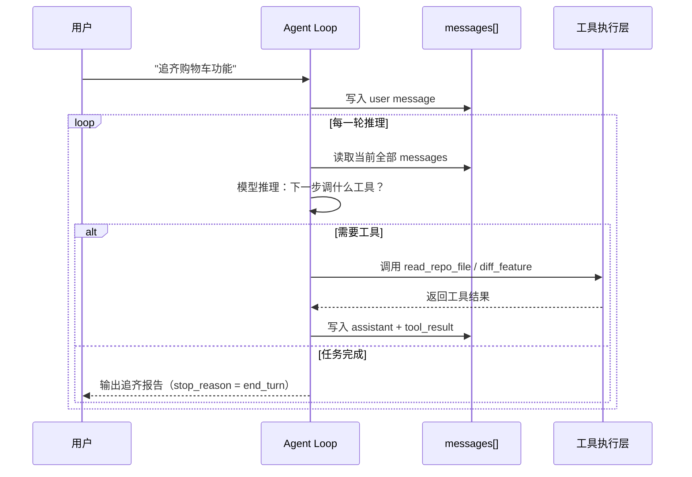
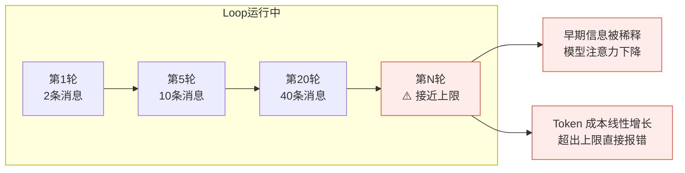

# 1.1 Agent Loop 的最小实现

> [!abstract] 本节导读
> 这一节从最小可运行代码出发，搞清楚 Agent 到底在"跑什么"。
> 理解 Loop 的结构，是后续所有设计决策（上下文、工具、记忆、规划）的基础。
> **前置知识**：能读懂 TypeScript，知道什么是 LLM API 调用和 Tool Use。
> **预计时长**：核心阅读 30 分钟，动手练习 20 分钟。

---

> [!question] 带着问题阅读
> 一个 Agent 和一次普通的 LLM 调用，结构上的本质区别是什么？

---

## 1. 核心结构：不到 20 行代码

很多人第一次接触 Agent，会以为它是个复杂的系统。
但剥开所有框架，Agent Loop 的骨架只有这些：

```typescript
const messages: MessageParam[] = [
  { role: "user", content: userInput }
];

while (true) {
  const response = await client.messages.create({
    model: "claude-opus-4-6",
    max_tokens: 8096,
    tools: toolDefinitions,
    messages,
  });

  if (response.stop_reason === "tool_use") {
    const toolResults = await Promise.all(
      response.content
        .filter((b) => b.type === "tool_use")
        .map(async (b) => ({
          type: "tool_result" as const,
          tool_use_id: b.id,
          content: await executeTool(b.name, b.input),
        }))
    );
    messages.push({ role: "assistant", content: response.content });
    messages.push({ role: "user", content: toolResults });
  } else {
    return response.content.find((b) => b.type === "text")?.text ?? "";
  }
}
```

> [!abstract] 定义
> **Agent Loop** 是 Agent 的运行心跳：模型每次推理 → 决定调用工具或结束 → 执行工具 → 把结果写回 messages → 下一轮推理。这个循环不断重复，直到模型认为任务完成。

对应的控制流如下：


这段代码有三件关键的事：

1. **`messages` 是唯一的状态容器**：Agent 知道的一切，都在这个数组里。
2. **`while (true)` 是驱动力**：只要模型还想用工具，循环就继续。
3. **`stop_reason` 是终止信号**：模型主动说"我做完了"，循环才停。

---

## 2. 四个阶段，循环不止

Loop 里每一轮，都经历这四个阶段：

![[agent-loop-cycle.excalidraw]]

> [!tip] 原则
> **Loop 本身是稳定的，变化的是 messages 里装了什么。**
> 后续你设计上下文、记忆、工具，本质上都是在优化"模型每轮能感知到什么"。

---

## 3. 为什么说 Loop 结构"几乎不需要改"

看过不少 Agent 实现，从最简 Demo 到支持子 Agent、上下文压缩、Skills 动态加载的复杂系统，**主循环基本没有变过**。

新能力只通过三种方式叠加，不改动循环本体：

| 扩展方式 | 例子 |
|---|---|
| 扩展工具集 | 加一个 `read_file` 工具 |
| 调整系统提示结构 | 注入 Skills 或 MEMORY.md |
| 状态外化到外部系统 | 进度写入文件，下次 session 续跑 |

> [!warning] 误区
> 不要让 Loop 体本身变成一个巨大的状态机。
> **模型负责推理，外部系统负责状态和边界**——一旦这个分工乱了，Loop 就很难维护。

---

## 4. 实战视角：功能追齐 Agent 的 Loop 长什么样

我们要做的功能追齐 Agent，Loop 结构和上面几乎一样，只是 `toolDefinitions` 和 `executeTool` 的内容不同：

```typescript
// 功能追齐 Agent 的工具集（第一版）
const toolDefinitions = [
  {
    name: "read_repo_file",
    description: "读取指定仓库的文件内容。用于读取 App 或 H5 的源码、测试用例。",
    input_schema: { repo: "string", path: "string" }
  },
  {
    name: "diff_feature",
    description: "对比 App 端和 H5 端的功能实现差异，输出缺失项和不一致项。",
    input_schema: { feature: "string", app_repo: "string", h5_repo: "string" }
  }
];
```

**一次追齐任务的 Loop 过程大致是这样的：**



> [!example] 案例
> 注意第 4 轮：模型自己判断"已有足够信息，不需要再调工具"，直接给出结论。
> 这就是 Agent 和 Workflow 的核心区别——**终止条件不是代码写死的，是模型推理出来的。**

---

## 5. Loop 的天花板在哪里

Loop 本身非常稳定，但它有一个天然限制：

**`messages[]` 会无限增长，而模型的 Context Window 是有上限的。**



随着工具调用越来越多，历史越堆越长，有两件事会发生：
- 早期的关键信息被"稀释"，模型注意力下降
- Token 成本线性增长，超出 Context 直接报错

这就是为什么后续章节要专门讲**上下文压缩、记忆系统和跨 session 续跑**。
它们都是在解决同一个问题：**如何让 Loop 能跑得更长、更稳、更准。**

> [!info] 方法
> 当你的 Agent 在长任务里开始"遗忘"或"乱跑"，第一个检查点是 `messages[]` 的内容质量，而不是模型能力。

---

## 小练习

> [!question] 练习
> 把上面的最小 Loop 代码跑起来，给它一个工具：`read_file(path)`，让它读取你本地某个项目的 `package.json`，告诉你这个项目用了哪些依赖。
>
> 跑完后观察：
> 1. Loop 跑了几轮才结束？
> 2. `messages[]` 里最终有几条消息？每条是什么角色？
> 3. 如果去掉 `tools`，模型会怎么回应？

---

## 本节小结

- Agent Loop 的核心是 `while (true)` + `messages[]` + 工具执行
- 四个阶段：感知 → 决策 → 行动 → 反馈，循环直到模型主动终止
- Loop 本身稳定，所有扩展都叠加在外部，不改循环本体
- `messages[]` 无限增长是 Loop 的天花板，是后续章节要解决的核心问题

## 下一节预告

> [!note] 下一节
> **1.2 Workflow vs Agent：控制权在谁手里**
> Loop 跑起来了，但什么时候该用 Agent，什么时候用 Workflow 更合适？
> 这个判断比你想象中更重要——用错了框架，再好的 Loop 也解决不了问题。

---

## 延伸阅读

> [!note] 延伸阅读
> **必读**
> - [你不知道的 Agent：原理、架构与工程实践](https://tw93.fun/2026-03-21/agent.html) — Agent Loop 最小实现的工程视角，含控制流变体分析
>
> **延伸**
> - [Building effective agents - Anthropic](https://www.anthropic.com/research/building-effective-agents) — 官方对 Agent Loop 与控制流的系统性描述
